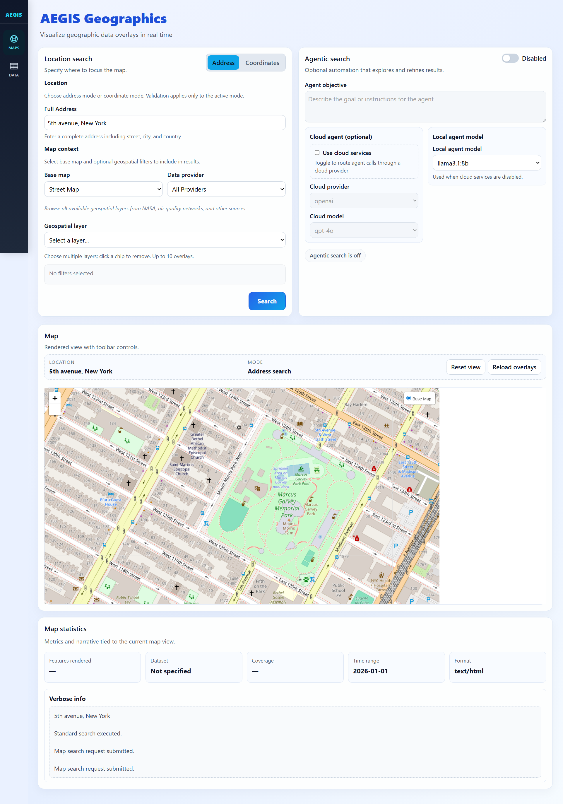
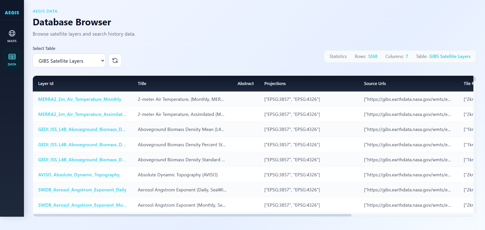

# AEGIS Geospatial View

## 1. Project Overview
AEGIS Geospatial View turns place names or coordinates into consistent bounding boxes and previewable map imagery. It addresses the challenge of translating ambiguous location input into standardized geospatial extents and quick-look visualizations. The system includes a backend API for geocoding, imagery selection, and metadata preparation, paired with a web frontend that collects user input and renders map previews. The frontend communicates with the backend over local HTTP during interactive use.


## 2. Installation

### 2.1 Windows (One Click Setup)
Run `AEGIS/start_on_windows.bat` to provision everything automatically. The launcher:

1. Downloads portable Python and Node.js runtimes inside the project directory
2. Installs backend and frontend dependencies
3. Builds the frontend
4. Starts the backend and frontend and opens the browser UI

**First Run**: Expect a 2-5 minute setup while runtimes and dependencies download to `AEGIS/resources/runtimes/`.  
**Subsequent Runs**: Launches in seconds using the cached runtimes and installed packages.

**Portability**: Everything stays inside the project folder. No system-wide installs are required.

### 2.2 macOS / Linux (Manual Setup)
**Prerequisites:**
- **Python 3.14+**
- **Node.js 18+** and npm
- A recent version of `pip` (or `uv`)

**Setup Steps:**
1. Create and activate a Python 3.14+ environment.
2. Install backend dependencies from the repository root:

```bash
pip install -e . --use-pep517
# or
uv pip install -e .
```

3. Install frontend dependencies:

```bash
cd AEGIS/client
npm install
```

## 3. How to Use

### 3.1 Windows
Run `AEGIS/start_on_windows.bat`. The application opens at `http://127.0.0.1:7861`.

### 3.2 macOS / Linux
Start backend and frontend from separate terminals:

```bash
# Terminal 1: start backend
uvicorn AEGIS.server.app:app --host 127.0.0.1 --port 8000

# Terminal 2: start frontend
cd AEGIS/client
npm run dev -- --host 127.0.0.1 --port 5173
```

The UI runs at `http://127.0.0.1:5173`, the backend API is at `http://127.0.0.1:8000`, and API documentation is available at `http://127.0.0.1:8000/docs`.

### 3.3 Using the Application
Enter a place name or coordinates, choose imagery options (such as layer, date, and output size), and request a preview. Review the returned map imagery and bounding box metadata, then adjust inputs as needed for comparison or validation.



Search panel for entering a place or coordinates and selecting imagery options.


Preview area showing the generated map and summary metadata.

## 4. Setup and Maintenance
Run `AEGIS/setup_and_maintenance.bat` for routine tasks:

- **Remove logs** - clear accumulated files in `AEGIS/resources/logs`
- **Uninstall app** - remove cached runtimes, lock files, virtual environments, and frontend build artifacts
- **Initialize database** - set up the local database used by the application
- **Update NASA GIBS layers** - refresh imagery layer metadata

## 5. Resources
Project resources are stored under `AEGIS/resources`. Each subdirectory contains data or assets used at runtime:

- **database:** cached geospatial datasets used for lookups and normalization
- **logs:** backend and launcher logs; safe to clear through the maintenance script
- **models:** reserved for optional model assets if configured
- **runtimes:** portable Python, uv, and Node.js installations managed by the Windows launcher
- **templates:** starter configuration files such as the `.env` template

## 6. Configuration
Backend configuration is loaded from `AEGIS/settings/.env` (copy from `AEGIS/resources/templates/.env`). Optional provider settings are stored in `AEGIS/settings/configurations.json`. Frontend configuration can be overridden through `AEGIS/client/.env` when needed.

| Variable | Description |
|----------|-------------|
| FASTAPI_HOST | Backend host address (`AEGIS/settings/.env`, default `127.0.0.1`) |
| FASTAPI_PORT | Backend port (`AEGIS/settings/.env`, default `8000`) |
| MPLBACKEND | Server-side rendering backend (`AEGIS/settings/.env`, default `Agg`) |
| VITE_API_BASE_URL | Frontend API base URL (`AEGIS/client/.env`, default unset; falls back to the Vite dev proxy) |

Copy `AEGIS/resources/templates/.env` into `AEGIS/settings/.env` and create `AEGIS/client/.env` for frontend overrides when needed.

## 7. License
This project is licensed under the terms of the MIT license. See `LICENSE` for details.
