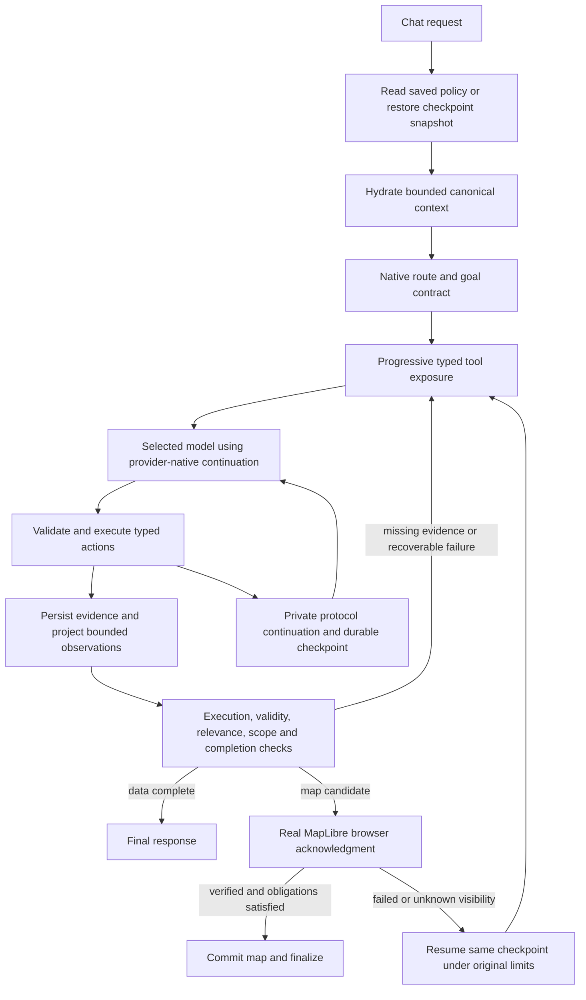
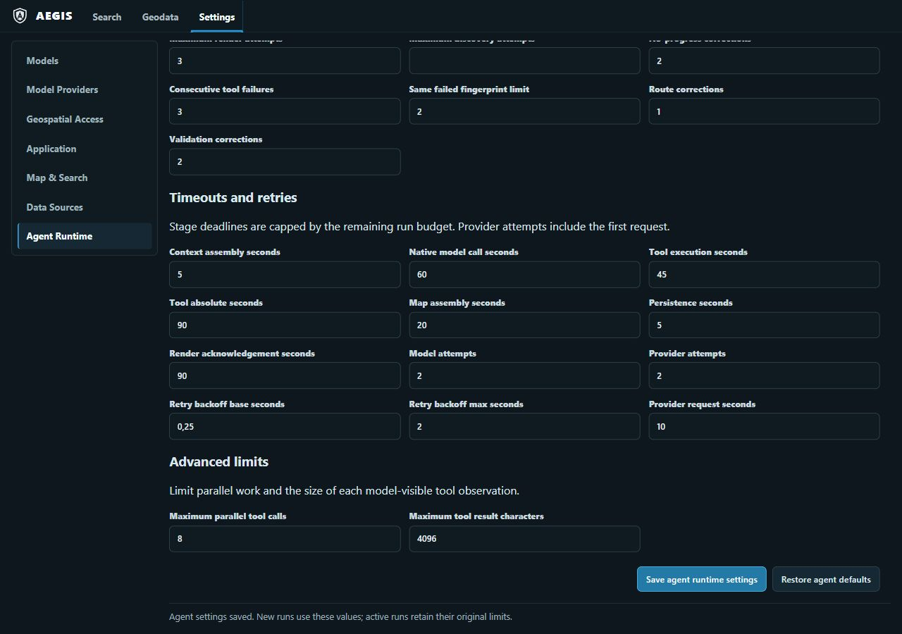

# AEGIS native agent reliability implementation — 2026-09-30

Overall status: **PARTIAL**. This report covers local working-tree changes on
`develop`. The tree initially had no tracked modifications. HEAD was observed at
`0c961d59a3e2f8e8ea075d9f79901147e9700b8b` during final review; another task's
existing provider/raster ledger evidence is preserved. Validation preceded the
user-authorized commit/push handoff. This implementation does not establish
hosted CI or live model parity.

## A. Architecture



The native harness retains routing, execution, evidence, state, cancellation,
completion, and rendering responsibilities. No second harness or MCP production
path was introduced. Provider-specific ordered content is private protocol state,
not ordinary model reasoning text or user-facing telemetry. Public projection
removes it without mutating resumable state.

Changes address four concrete gaps: flattened Google tool turns lost native
parts/signatures/IDs; generic successful evidence could satisfy unrelated scope;
settings were loaded once rather than applied to new runs; inventory pagination
could consume model calls or truncate at 50 candidates. Renderer loading checks
also lacked a distinction between loaded structure and visible raster results.

## B. Code changes

The exact file inventory and Python symbols appear below. No dependency, schema
migration, lockfile, environment configuration, or MCP package was introduced.
Existing JSON runtime settings and private checkpoint/presentation JSON store the
new discovery setting and execution snapshots. OpenAPI was regenerated.

Key changes:

- `GoogleProvider` parses the selected candidate and preserves complete native
  `Content`. Function responses match call IDs and parallel responses remain
  grouped. Ten sequential parallel-call steps survive SDK/JSON round trips.
- `AgentLoop` retains complete Google protocol continuation for the bounded run,
  emits decision/exposure identifiers, delegates data/scope completion, and
  advances inventory cursors without another model invocation. Synthetic pages
  never masquerade as provider-generated tool calls.
- `CompletionEvaluator.assess_evidence/data_checks` distinguish execution,
  validity, relevance, spatial and temporal coverage. All explicitly requested
  capabilities must be covered. Unsupported/unknown coverage remains pending.
- `CapabilityExecutionService` checks actual GeoJSON geometry against requested
  bounding boxes and marks malformed/outside geometry unsatisfied.
- `ToolExecutor` projects the assessment to observations and operational traces.
- `NativeAgentOrchestrator`, `AgentTurnRunner`, and composition read new saved
  policies and restore checkpoint policies. Request-scoped copies and a resetting
  provider ContextVar preserve shared runtime ownership.
- `RenderCompletionService` snapshots acknowledgment timeout/attempt limits,
  retains evidence obligations at preparation, and makes server-rejected ready
  acknowledgments idempotent even after the final attempt.
- `AgentRunRepository` refuses required visible rasters without explicit visibility
  proof. The frontend reports actual vector feature counts and unknown raster
  visibility rather than equating source loading with visible pixels.
- Settings drafts send changed fields only, show four practical groups, enforce
  existing schema bounds, and provide draft-only default restoration.
- REST, polling, conversation snapshots, stream events, realtime messages, and
  run-trace projections omit private SDK continuation.

Intentionally omitted: a replacement agent framework, broad direct-tool catalog,
blanket MCP conversion, a second routing hierarchy, a speculative MCP pilot,
SDK upgrades, legacy-mode switches, and a raster-pixel heuristic. Existing bounded
retry, argument correction, alternate discovery, evidence inspection/transform,
map replanning, cancellation, and checkpoint mechanisms were retained.

## C. Agent behavior

| Trigger | Earlier behavior/gap | Current controlled behavior |
| --- | --- | --- |
| Google multi-step parallel calls | Common semantic reconstruction could discard opaque native content | Ordered selected-candidate parts, signatures and IDs round-trip intact |
| HTTP/tool success without evidence | Success could count as data completion | Requires saved evidence or an explicitly typed normalized result |
| Empty result | Empty could be treated as automatically sufficient | Requires resolved negative outcome or explicit query-complete coverage |
| Wrong spatial/date scope | Data presence/candidate labels could satisfy scope | Actual bbox geometry, coverage flags and observation dates are checked |
| Multi-source request | First successful source could satisfy data | Every explicit capability must have eligible evidence |
| Incomplete/irrelevant result | Successful status hid uncertainty | Partial results do not complete; irrelevant IDs/flags and unknown scopes remain pending |
| Complete inventory | Fixed shortlist/pagination consumed model turns | Full ranked inventory is paged; ordinary selection remains bounded |
| Required raster loaded but blank/unknown | Source/layer readiness could imply render success | False/unknown result visibility becomes bounded render failure |
| Saved execution limits | Startup-owned policy could remain stale | New runs read saved policy; active/resumed runs retain original snapshot |

Each observation contains a bounded `assessment` with execution success,
validity, relevance, spatial/temporal truth or unknown, and actionable reasons.
It does not contain a universal semantic proof. Subject matching beyond explicit
capability IDs and declared provider flags, required resolution, arbitrary geometry
relationships, and comprehensive temporal semantics still need provider-specific
contracts and additional fixtures.

Resource limits include elapsed deadline, model/tool calls, state transitions,
iterations, parallelism, duplicate failed fingerprints, route/validation/no-progress
corrections, discovery attempts, transport retries/backoff, and render attempts.
Pagination still consumes tool/iteration/transition budgets. Cancellation and
supersession retain the existing checks. There is no automatic model substitution.

**Material raster limitation:** the client currently emits `result_visible=null`
for rasters. Required visible rasters therefore cannot finalize through a ready
acknowledgment until an authoritative visibility producer exists. This is deliberate
fail-closed behavior, but it is not complete raster rendering support. A loaded
transparent fixture is tested at the contract boundary, not as live browser pixels.

## D. MCP decision

| Option | Decision | Evidence boundary |
| --- | --- | --- |
| A — Direct tools | Do not replace bounded native tools | Broad schema/token/correctness costs not measured |
| B — Thematic MCP | No blanket conversion | No external client or isolation requirement established |
| C — Native dynamic tools | Retain production architecture | Existing validated route/executor/evidence/checkpoint boundaries |
| D — Hierarchical routing | Retain the existing native routing stage | Additional hierarchy has no demonstrated benefit |
| E — Hybrid | Optional future boundary | Requires a concrete independently hosted read-only capability and measurable value |

No pilot was performed. No cross-architecture performance winner is claimed.
The comparison is an implementation/requirements assessment, not an empirical
A–E benchmark. [The architecture document](../docs/geospatial/agent_runtime_v2.md)
records the official MCP specification/SDK research and the unmeasured criteria.
Official provider guidance used: [Google thought signatures](https://ai.google.dev/gemini-api/docs/generate-content/thought-signatures),
[Google function calling](https://ai.google.dev/gemini-api/docs/function-calling),
and [OpenAI function calling](https://developers.openai.com/api/docs/guides/function-calling).

## E. Settings

There are 31 editable `agent_execution` fields. The generated inventory below
records defaults and API bounds. An agent-only partial PATCH atomically validates
and saves with `restart_required=false`; mixed/non-agent changes retain the
existing restart behavior. New runs snapshot saved values; active/suspended runs
restore original policy before context assembly, model/tool/provider execution,
and render acknowledgment. Restore defaults affects the draft until Save.

The browser changed maximum discovery attempts from 2 to 5, saved successfully,
displayed the new-run/no-restart confirmation, then restored defaults and saved
2. Backend tests cover invalid atomic rejection; client tests cover changed-only
patches and draft restoration. The settings test checks both new-run application
and checkpoint retention, not an actual provider billing/latency comparison.



## F. Validation

| Check actually run | Result | Evidence |
| --- | --- | --- |
| Initial scoped baseline | 56 passed | baseline log/XML |
| Full backend unit suite | 1,025 passed, 2 dependency deprecation warnings, 32.43 s | unit log/XML |
| Final focused backend suite after resume-policy correction | 366 passed, 2 warnings, 3.73 s | focused log/XML |
| Ruff backend/tests | Passed; three pre-existing inaccessible ignored QA directories warned | Ruff log |
| Strict Pyright, correct project/venv | 0 errors, 0 warnings | Pyright log |
| Angular production build | Passed, 6.492 s reported | build log |
| Focused Settings/map/realtime client suite | 71 passed | frontend log |
| Settings UI in Codex in-app Browser | Save, no-restart notice, restore defaults/save visually passed | JPG above |
| Fresh isolated backend startup | Started and applied existing migrations | observed runtime; no migration change |
| Process/browser cleanup | Owned backend/frontend stopped, tab closed, viewport reset; ports 8000/4200/9876 free | final cleanup log |

Commands used from repository root unless noted:

```powershell
app/server/.venv/Scripts/python.exe -m pytest -c app/server/pyproject.toml app/tests/unit --basetemp="<repo>/runtimes/cache/pytest-tmp/native-reliability" -q --junitxml=assets/QA/native-reliability-unit-20260930.xml
app/server/.venv/Scripts/ruff.exe check app/server app/tests --config app/server/pyproject.toml
# From app/server:
.venv/Scripts/pyright.exe --project pyproject.toml
# From app/client, using runtimes/nodejs and ChromeHeadlessNoGpu:
node node_modules/@angular/cli/bin/ng.js build
node node_modules/@angular/cli/bin/ng.js test --watch=false --browsers=ChromeHeadlessNoGpu --include=src/app/pages/settings-page.component.spec.ts --include=src/app/components/map-preview.component.spec.ts --include=src/app/core/realtime-parsers.spec.ts
```

Deterministic additions cover ordered Google parallel/repeated-name/ID/signature
continuation and first-candidate selection; multisource completion, unrelated
capability, wrong/unknown spatial and temporal scope; bbox inside/outside/malformed
geometry; 117-entry pagination with an exhausted model budget; run snapshots and
provider policy reset; required raster unknown/false visibility and duplicate
terminal acknowledgment; missing checkpoint evidence during map preparation;
public protocol redaction; hot/invalid settings and changed-only/default drafts.
Existing regression tests exercise ordinary recovery/cancellation and rendering
contracts. This is not the complete requested live 22-scenario trajectory matrix.

A mistakenly targeted Pyright invocation used a nonexistent config, produced
default-environment errors, and was corrected to the repository's pyproject and
existing venv. Intermediate fixture failures were fixed before final checks.
No dependency upgrade or relaxed static check was used to obtain a pass.

Performance: suite/build elapsed times are recorded above. There is no comparable
end-to-end before/after provider dataset, latency distribution, success rate,
schema-token comparison across A–E, or MCP discovery/connection measurement.
Protocol tests use the installed SDK and deterministic responses; no fresh live
Google/OpenAI/OpenCode/Ollama call was made. The disposable runtime had no selected
provider/model. Existing real-raster and hosted evidence belongs to other ledger
slices and is not promoted by these local checks.

## G. Final status and actionable work

Completed locally: native SDK continuation corrections, typed evidence assessment,
scope/multisource safeguards, deterministic inventory pages, settings hot snapshots,
bounded renderer failure/idempotency contracts, public continuation filtering,
MCP decision, and scoped regression/visual Settings validation.

Partially completed: full task semantics and telemetry baseline measurement;
browser-authoritative raster visibility/recovery; consolidated live E2E and
benchmark acceptance. Blocked in this disposable runtime: selected live provider
lane, because no provider/model is configured there. Deferred by the documented
decision: optional MCP pilot without an established external consumer/isolation need.

Remaining actionable work:

1. Implement and validate attributable raster pixel visibility, including a loaded
   transparent tile, then prove same-run correction/finalization in the real browser.
2. Extend provider-specific subject, resolution, geometry relationship and temporal
   coverage contracts; verify legitimate empty/negative evidence end to end.
3. Run the complete deterministic/live recovery matrix under the exact selected
   provider/model, including persistence restart, cancellation and concurrent settings.
4. Measure comparable baseline/after success, recovery, token and latency distributions.
5. Validate required migration/release/hosted gates for a reviewed committed revision.

The plan's global acceptance criteria are not fully satisfied. Do not treat this
working tree as complete live-provider, raster, or release readiness.

## Editable-setting inventory (generated from the API schema)

| Field | Default | Minimum | Maximum |
| --- | --- | --- | --- |
| `initial_run_seconds` | 90.0 | 1.0 | 300.0 |
| `simple_seconds` | 150.0 | 1.0 | 300.0 |
| `complex_seconds` | 300.0 | 1.0 | 300.0 |
| `context_assembly_seconds` | 5.0 | 0.1 | none |
| `native_model_call_seconds` | 60.0 | 0.1 | none |
| `tool_execution_seconds` | 45.0 | 0.1 | 90.0 |
| `tool_absolute_seconds` | 90.0 | 0.1 | 90.0 |
| `map_assembly_seconds` | 20.0 | 0.1 | none |
| `persistence_seconds` | 5.0 | 0.1 | none |
| `render_ack_seconds` | 90.0 | 0.1 | 90.0 |
| `max_tool_result_chars` | 4096 | 128 | 100000 |
| `max_iterations` | 12 | 1 | 100 |
| `max_render_attempts` | 3 | 1 | 32 |
| `max_discovery_attempts` | 2 | 1 | 100 |
| `max_no_progress_corrections` | 2 | 0 | 8 |
| `simple_max_model_calls` | 4 | 1 | 100 |
| `complex_max_model_calls` | 10 | 1 | 100 |
| `simple_max_tool_calls` | 6 | 1 | 200 |
| `complex_max_tool_calls` | 20 | 1 | 500 |
| `simple_max_state_transitions` | 32 | 1 | 500 |
| `complex_max_state_transitions` | 64 | 1 | 1000 |
| `max_parallel_tool_calls` | 8 | 1 | 32 |
| `max_consecutive_tool_failures` | 3 | 1 | 20 |
| `max_same_failed_fingerprint` | 2 | 1 | 20 |
| `max_route_corrections` | 1 | 0 | 10 |
| `max_validation_corrections` | 2 | 0 | 20 |
| `model_max_attempts` | 2 | 1 | 10 |
| `provider_max_attempts` | 2 | 1 | 10 |
| `retry_backoff_base_seconds` | 0.25 | 0.0 | 60.0 |
| `retry_backoff_max_seconds` | 2.0 | 0.0 | 120.0 |
| `provider_request_seconds` | 10.0 | 0.1 | 120.0 |

## Exact modified-file and symbol inventory

Paths are repository-relative. QA additions are listed separately below. Python
symbols are selected by overlap with changed lines; class declarations include
changed fields, and other files name their contract/component boundary.

| File | Changed symbols or boundary |
| --- | --- |
| `app/client/src/app/components/map-preview.component.ts` | MapPreviewComponent |
| `app/client/src/app/core/types.ts` | agent_execution schema/types |
| `app/client/src/app/pages/settings-page.component.html` | SettingsPageComponent |
| `app/client/src/app/pages/settings-page.component.spec.ts` | SettingsPageComponent |
| `app/client/src/app/pages/settings-page.component.ts` | SettingsPageComponent |
| `app/server/api/chat.py` | _stream_event, chat_turn |
| `app/server/api/conversations.py` | get_conversation_snapshot, get_run_status |
| `app/server/configurations/settings.py` | AgentExecutionSettings, JsonAgentExecutionSettings, AppSettings, _normalize_key_mapping, to_server_settings |
| `app/server/contracts/chat.py` | ChatStreamEvent, serialize_public_data |
| `app/server/domain/agent/capability_route.py` | AgentRunState, _checkpoint_tool_result, checkpoint |
| `app/server/domain/agent/reliability.py` | AgentExecutionBudget, snapshot, restore_from_snapshot |
| `app/server/domain/agent/tool_result.py` | EvidenceAssessment, ToolResult, ModelObservation, from_tool_result |
| `app/server/domain/agent/trace.py` | public_protocol_projection |
| `app/server/domain/geospatial/providers.py` | current_provider_policy, provider_execution_scope |
| `app/server/domain/llm/types.py` | LLMResult |
| `app/server/domain/realtime.py` | RealtimeRenderAckPayload, RealtimeServerMessage, sanitize_overlay_results, serialize_public_payload |
| `app/server/repositories/agent_runs.py` | AgentRunRepository, acknowledge_render |
| `app/server/services/agent/agent_loop.py` | AgentLoop, _run_iteration, _emit_trace, _completion_checks, _protocol_messages, _assistant_and_tool_messages |
| `app/server/services/agent/capability_execution.py` | CapabilityExecutionService, execute_capability |
| `app/server/services/agent/completion.py` | CompletionEvaluator, assess_evidence, data_checks, covered |
| `app/server/services/agent/native_orchestrator.py` | NativeAgentOrchestrator, __init__, _run_serialized, _new_execution_budget |
| `app/server/services/agent/tool_executor.py` | ToolExecutor, execute_tool, _result_trace_payload |
| `app/server/services/agent/tool_handlers/catalog.py` | CatalogToolHandler, _cursor_offset, discover |
| `app/server/services/agent/tool_registry.py` | ToolRegistry, expose |
| `app/server/services/agent/turn_runner.py` | AgentTurnRequest, AgentTurnRunner, run |
| `app/server/services/agent_runs/render_completion.py` | RenderCompletionService, prepare, acknowledge |
| `app/server/services/chat/composition.py` | build_chat_runtime |
| `app/server/services/geospatial/capability_registry.py` | CapabilityRegistry, shortlist |
| `app/server/services/geospatial/provider_registry.py` | ProviderRegistry, fetch, _retry_delay_seconds, _timeout_seconds, _ensure_circuit_closed, _record_failure |
| `app/server/services/llm/google_provider.py` | GoogleProvider, _parse_tool_calls, chat, _continuation_content, _contents_from_messages |
| `app/server/services/settings/runtime_settings.py` | RuntimeSettingsService, update_settings |
| `app/shared/openapi.json` | agent_execution schema/types |
| `app/tests/unit/api/test_realtime_api.py` | test_public_transports_omit_private_provider_continuation_without_mutation |
| `app/tests/unit/services/agent/test_agent_loop_v2.py` | test_catalog_pages_continue_without_additional_model_calls, FakeProvider, test_verified_render_emits_tools_disabled_finalization_trace, test_completion_requires_verified_scope_for_every_requested_source, page, result |
| `app/tests/unit/services/agent/test_capability_execution.py` | test_provider_geometry_is_checked_against_requested_bbox |
| `app/tests/unit/services/agent/test_turn.py` | test_run_policy_snapshot_survives_settings_change_and_checkpoint, capture, request |
| `app/tests/unit/services/llm/test_google_provider_tool_loop.py` | test_google_converts_tool_results_to_function_responses, test_native_parts_survive_sequential_parallel_checkpoint_continuation, test_only_first_google_candidate_is_executed |
| `app/tests/unit/services/test_render_completion.py` | test_map_preparation_cannot_override_missing_checkpoint_evidence, test_loaded_raster_without_visibility_proof_resumes_with_original_policy |
| `app/tests/unit/test_runtime_settings_api.py` | test_runtime_settings_api_returns_typed_blocks_and_restart_metadata, test_agent_policy_patch_applies_to_new_runs_and_rejects_invalid_values_atomically |
| `assets/docs/architecture/execution_and_data_flow.md` | documentation |
| `assets/docs/geospatial/agent_runtime_v2.md` | documentation |
| `assets/docs/project_status_ledger.md` | documentation |
| `assets/docs/runtime/configuration.md` | documentation |
| `assets/docs/user/settings_and_access.md` | documentation |
| `assets/docs/validation/gate_status.md` | documentation |

QA files added in `assets/QA/`: this report; `native-reliability-{baseline,focused,unit}-20260930.{log,xml}`; `native-reliability-{build,frontend,pyright,ruff,cleanup}-20260930.log`; `native-reliability-settings-20260930.jpg`. No new production source files were added.
