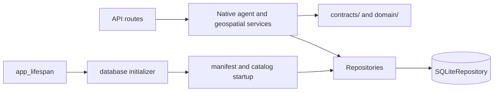

# Execution And Data Flow

Last updated: 2026-09-17

## Layering

AEGIS uses these backend layers:

- API routes: `app/server/api/*.py`
- Prompt declarations/builders: `app/server/prompts/*.py`
- Services and orchestration: `app/server/services/**`
- Persistence: `app/server/repositories/**`
- Application contracts: `app/server/contracts/**`
- Domain behavior and policies: `app/server/domain/**`
- Configuration models: `app/server/configurations/**`

## Layering rules

- API routes translate service exceptions into HTTP responses.
- Services do not import FastAPI.
- Repositories remain the persistence boundary.
- `app/server/app.py` is the composition root; it builds settings,
  repositories, provider runtimes, agent services, and lifecycle services.
- Stateful dependencies are explicit constructor arguments.
- Provider adapters normalize protocol responses and failures at the LLM or
  geospatial boundary; agent services consume provider-neutral contracts.
- `services/agent/` owns the native route, loop, policy, validation, evidence,
  map, and response boundaries. It does not define free-form model prompts.
- `services/llm/` owns provider invocation and protocol translation.
- `app/server/prompts/` is the sole source of free-form model instructions.
- Runtime job state is owned by `app/server/services/jobs.py`; durable run and
  conversation state remain repository-owned.

The composition boundary is intentionally explicit:



Run-service errors are classified at the realtime protocol boundary. The
realtime service verifies the conversation-to-run relationship before starting,
steering, cancelling, or acknowledging a run.

## Representative request flow

Chat requests flow through:

1. `chat.py` validates the request and conversation identity.
2. `ChatRuntime` supplies the composed native orchestrator and repositories.
3. `NativeAgentOrchestrator` hydrates `ConversationState`, history, directives,
   map memory, and relevant evidence summaries.
4. `AgentContextAssembler` builds one bounded `AgentContextPackage`.
5. `AgentStateFactory` creates the canonical checkpointable `AgentRunState`.
6. `AgentLoop` routes, compiles the goal, exposes tools, calls the model,
   executes typed actions, projects observations, and evaluates completion.
7. `NativeAgentOrchestrator` writes the next canonical conversation state and
   assistant history with optimistic revision control.
8. `AgentRunOrchestrator` completes a data-only run or hands a map candidate
   to `RenderCompletionService` for browser acknowledgment. A render
   acknowledgment is a continuation event, not an implicit terminal result.

The geospatial runtime is composed once at startup and accessed through
`app.state.geospatial_runtime`. Routes do not construct a fallback runtime at
request time.

## Native agent loop

There is one application execution path. It has no legacy/shadow/native mode
switch:

```text
conversation state
      ↓ hydrate
route_request
      ↓ deterministic route validation and capability narrowing
goal/completion contract
      ↓
build bounded context view
      ↓
model decision
      ↓
typed tool call → schema/semantic/policy validation → ToolExecutor
      ↓
ToolResult → bounded ModelObservation → canonical state update
      ↓
completion evaluation
      ├─ continue with a new model view
      ├─ ask for clarification
      ├─ await browser render acknowledgement
      │       ↓
      │   RenderObservation → same checkpoint → correction/retry or finalization
      └─ finalize a grounded response
```

`AgentRunState` owns route, goal, requirements, locations, evidence refs,
observations, provider continuation, counters, traces, and terminal reason.
`AgentContextView` is rebuilt before each model decision. Raw datasets are
stored in `agent_evidence` and are never copied into the model context.

The native bootstrap route distinguishes:

- accepted route with a deterministic shortlist;
- discovery-required route when no confident shortlist exists;
- clarification for missing/ambiguous user information; and
- no-capability after explicit or bounded discovery has been exhausted.

The model selects semantic actions. AEGIS binds validated location references,
coordinates, bbox/radius, temporal boundaries, provider argument names, and
task-owned filters at the execution boundary.

## Canonical state and context

`ConversationState` is the revisioned durable state for a conversation. It
contains active directives, summary, goal/route/constraints, resolved
locations, evidence references, committed map session, and unresolved
questions.

`AgentRunState` is the mutable state for one run and is JSON-checkpointable.
`AgentContextView` is ephemeral. `AgentEvidence` is durable external data, and
`AgentTrace` is append-only operational metadata.

`AgentContextAssembler` owns semantic reduction. It preserves mandatory goal,
directive, map, task, and policy fields; ranks evidence by current goal,
scope, explicit references, and recency; skips oversized messages while
continuing to inspect later smaller items; and serializes only valid bounded
objects. Provider context preparation may enforce a final protocol limit but
does not choose semantic history.

Every model request records estimated and provider-reported usage, tool-schema
tokens, output reserve, usable limit, compaction, and cumulative run usage.
Provider continuation items are kept separately from semantic context and are
bounded to the most recent protocol window.

## Tool and manifest boundaries

`ToolRegistry` is the only registry and exposes the small permanent tool set:

- `resolve_geospatial_location`
- `discover_geospatial_capabilities`
- `discover_geospatial_provider_layers`
- `describe_geospatial_capability`
- `execute_geospatial_capability`
- `inspect_evidence`
- `transform_evidence`
- `apply_map_plan`

`route_request` is an internal bootstrap definition. `ToolExecutor` is the
only execution boundary; it validates input, applies policy, counts attempts,
records timeout/trace metadata, invokes the handler, and normalizes one
`ToolResult`.

`manifest_loader.py` reads schema-v2 entries from `app/resources/catalog`.
Agent-facing entries must declare `agenticUse.domains` and an explicit
`executionContract`. `CapabilityRegistry` applies runtime availability,
coverage, temporal, scope, operation, render, and relevance filters without
inferring a second contract from free text or capability kind.

Provider-layer discovery and capability descriptions are canonical native
handlers. Both return bounded descriptors, deterministic pagination, and
evidence references where external metadata is persisted.

## Evidence, observations, and responses

`ToolResult` is the canonical application result. `ModelObservation` is its
model-facing projection. It preserves bounded tool-specific result data,
provider identity, freshness, observation time, resolution, units, coverage,
warnings, pagination, evidence refs, truncation, and recovery. Valid-empty is
distinct from failure and can drive a wider query, alternate source, or a
grounded zero-result answer.

`ChatTurnResponse` is the public native response. It contains the assistant
message, operation, route, goal, completion contract, tool summaries, trace,
context usage, conversation state, and optional map candidate. Parser/planner
projection fields are not part of the contract.

The structured model probe is a readiness check for the native route/tool
contract. It does not create a conversation or execute a provider capability.

## Map completion flow

`apply_map_plan` creates a typed candidate and suspends the run only while the
browser verifies it. For realtime runs:

1. the candidate is persisted as `awaiting_render`;
2. `map_prepared` publishes the exact run version, session ID, collection
   revision, and required render checks;
3. the browser validates the candidate in MapLibre and sends `map.render_ack`
   with bounded check and failure metadata;
4. `RenderCompletionService` verifies ownership, identities, revision, and
   completion requirements, then normalizes the outcome into a bounded
   `RenderObservation`;
5. the observation is persisted and reinjected into the same checkpoint. A
   failed render discards the candidate, preserves the last-known-good map,
   and resumes the model for a revised action; a ready render atomically
   promotes the candidate and resumes the run for a tools-disabled final
   answer (or for any remaining completion requirement); and
6. after three bounded render attempts, one finalization-only model call
   explains the failure and the run terminates as
   `render_recovery_exhausted`.

The last committed map remains active while a candidate is pending. Failed,
stale, conflicting, or superseded acknowledgments cannot replace it. Duplicate
identical acknowledgments are idempotent; stale or mismatched acknowledgments
remain protocol errors. A failed candidate/action fingerprint is not treated
as a reusable success, and exact failed repetition is rejected as non-progress.
Metadata-only products finalize as data responses without an impossible render
wait.

Location resolution is hierarchical and explicit. Ambiguous candidates produce
a clarification transition. Invalid location references produce semantic
validation; another available location is never silently substituted.

## Provider and timeout flow

The native run has one absolute deadline and bounded model, tool, transition,
retry, and stage limits. The timeout hierarchy is:

```text
run deadline
  > model decision
  > tool execution
  > provider operation
  > HTTP connection/read/write
```

Each child operation is capped by its parent. `ProviderRegistry` owns bounded
transport retries, rate limiting, provider deadlines, and circuit breaking.
After those retries are exhausted, the normalized failure returns to the
native loop for semantic recovery.

Terminal reasons remain distinct: `model_budget_exhausted`,
`tool_budget_exhausted`, `transition_budget_exhausted`,
`run_deadline_exhausted`, `no_progress`, `context_limit`, `provider_failure`,
`cancelled`, `superseded`, and `render_recovery_exhausted`.

## Async and threaded behavior

### Async

- FastAPI handlers are predominantly async.
- `POST /api/chat/stream` emits lifecycle NDJSON.
- Chat jobs run through `/api/chat/jobs` and are observed through
  `/api/jobs/{job_id}`.
- The realtime WebSocket supports session resume, run commands, steering,
  render acknowledgments, heartbeats, and ordered durable events.
- Render continuation publishes bounded `run_suspended`, `render_observed`,
  `run_resumed`, `completion_decision`, and (when needed)
  `render_retry_exhausted` trace events. These events expose operational state
  and sanitized outcomes without private model reasoning.
- Cancellation and version checks occur before/after external work and before
  durable commits. Tracked lifecycle tasks are directly cancelled on request.

### Threaded

- Long-running chat jobs use one in-memory `BackgroundJobService` worker.
- The selected deployment is a single backend replica; persisted event replay
  is the reconnect source of truth.
- Distributed workers, shared fanout, and external metrics are not part of the
  current local Windows runtime.

## Runtime constraints

- Job state is process-local and memory-backed.
- The Windows launcher/manual-start workflow is the supported local deployment.
- Async endpoints must avoid blocking CPU-heavy work on the event loop.
- Each native run persists bounded iteration checkpoints in the internal run
  event log and reloads the latest checkpoint when an active run is resumed.
  The in-memory background-job state itself remains process-local.
