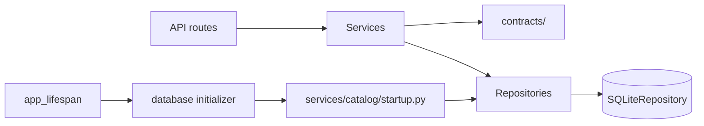

# Execution And Data Flow

Last updated: 2026-09-10

## Layering

AEGIS uses these main backend layers:

- API routes: `app/server/api/*.py`
- Prompt declarations and builders: `app/server/prompts/*.py`
- Services and orchestration: `app/server/services/**`
- Persistence: `app/server/repositories/**`
- Application contracts: `app/server/contracts/**`
- Domain behavior and policies: `app/server/domain/**`
- Configuration models: `app/server/configurations/**`

## Layering Rules

- API routes translate service exceptions into HTTP responses.
- Services do not import FastAPI.
- Repositories remain the persistence boundary.
- `app/server/app.py` is the sole composition root: it builds settings,
  persistence, repositories, and services, then stores the composed runtimes
  on `app.state`.
- Stateful dependencies are explicit constructor arguments. The shared
  conversation repository is passed to both chat and run-lifecycle services.
- `app/server/repositories/database/sqlite.py` defines the concrete SQLite database holder.
- `contracts/` holds transport, normalized-provider, extraction, run-event,
  and persistence-neutral application models.
- `domain/` owns structured schemas, domain behavior, and policies; `contracts/`
  owns application transport and persistence-neutral contracts.
- Provider adapters normalize JSON objects and provider failures at the LLM
  boundary; API and agent layers consume provider-neutral contracts.
- `services/agent/` owns deterministic orchestration, planning, policy, and
  validation; it consumes prompt builders but does not define free-form model
  instructions.
- `services/llm/` owns provider invocation and protocol translation; provider
  prompt text is declared in `app/server/prompts/providers.py`.
- `app/server/prompts/` is the sole source of free-form model instructions and
  prompt templates. Its modules are separated by parser, agent, response,
  context, and provider responsibilities.
- Runtime job state is owned by `app/server/services/jobs.py`.
- SQLite engine/session construction is centralized in `app/server/repositories/database/engine.py`.
- Static reference catalog file loading lives under `app/server/services/catalog/loader.py`; lookup and seeding live under `app/server/repositories/catalog/`.

The startup composition boundary is intentionally explicit:

Run-service errors are classified by the realtime protocol boundary. The
realtime service verifies the conversation-to-run relationship before starting,
steering, or cancelling a run, and returns structured protocol errors.

## Representative Request Flow

- endpoint (`chat.py` or `geospatial.py`)
- composition/orchestration service
- execution and provider services
- repository or database operations

Geospatial routes typically flow:

- `geospatial.py`
- `GeospatialApiService`
- provider/runtime services
- manifest or database repositories when required

Geospatial API services are composed during application startup and accessed through `app.state.geospatial_runtime`. Routes do not construct a fallback geospatial runtime at request time.

## Chat Orchestration Pipeline

The temporary `agent_execution.agent_loop_mode` rollout setting selects one of
three execution boundaries:

- `legacy` (default): the parser, deterministic policy/planning path, and
  existing native-tool fallback remain available for compatibility.
- `shadow`: the legacy path executes while the native registry computes a
  bounded exposure preview with no model, provider, tool, evidence, or map
  egress.
- `native_v2`: context assembly is followed directly by `NativeV2TurnRunner`
  and the bounded `AgentLoop`; the legacy parser, recovery, specialist router,
  capability resolver, policy preflight, and deterministic planner are not
  invoked.

### Legacy-compatible pipeline

1. `AgentOrchestrator` creates a run-local 75-second execution budget and loads volatile conversation task and visualization state.
2. `ParserService` receives a bounded projection of the current request, compact active location/map state, relevant capability identities, and only minimal follow-up history. It produces structured intent, relationship, entities, typed overlay commands, visualization changes, and ambiguities using the selected agent model and the canonical parser builder. The parser stage is capped at 30 seconds; only an incomplete semantic contract may receive one schema correction while at least 18 seconds remain.
3. A deterministic location-resolution stage resolves coordinates, addresses/POIs, districts, cities, regions, and countries into one `ResolvedLocation` with a target and ordered geographic parents. That object is stored in `AgentExecutionContext` and is the only run-scoped location authority.
4. `ConversationTaskStateService` creates or updates the current task record.
5. `CapabilityResolver` converts semantic layer concepts into enabled executable manifest IDs or returns a structured clarification when no temporally compatible capability exists.
6. `DeterministicAgentRouter` selects one specialist group.
7. `DeterministicToolPlanner` creates a typed, deduplicated dependency plan using the resolved location.
8. `PolicyEngine` restricts native tools and capability IDs to the routed scope.
9. `ToolPlanExecutor` applies the shared deadline, targeted transient retries, validation, and partial-failure tracking.
10. `NativeToolLoop` remains the bounded fallback when catalog discovery is required; its native-agent and replaceable working-state messages come from the canonical prompt builders, and active providers are called through their native async transport.
11. Verified results become a map session, direct answer, clarification, or diagnostic response.
12. Verified map-only results use deterministic response text; only narrative or direct-data answers invoke the selected agent model through one bounded `GroundedSynthesisResult` structured-output call. Deterministic prose remains the fallback.
13. Overlay changes are applied to the revisioned `OverlayCollectionState` by
    deterministic selector resolution. Additions resolve against the catalog;
    remove/keep-only/show/hide/update operate on active instances first, and
    stale or ambiguous commands preserve the current collection with a focused
    clarification. Clarification responses may carry a partial validated map
    update.
13. Task status, failure details, and active visualization are updated before persistence.

### Native-v2 pipeline

Native-v2 keeps the lifecycle and persistence boundary shared with legacy mode:

1. `AgentOrchestrator` loads idempotency, conversation history, directives,
   task/map memory, and the bounded context package.
2. `NativeV2TurnRunner` creates typed `AgentState` and invokes `AgentLoop`.
3. `AgentLoop` asks the model for `route_request`, validates the route, exposes
   only registry tools allowed for the current state, executes through the
   canonical typed executor, and stops on evidence/completion/deadline rules.
4. `NativeV2ResponseBuilder` emits one operation, bounded tool-result summaries,
   route metadata, execution trace, and an optional map candidate.
5. The orchestrator persists one terminal conversation state. Native map
   candidates remain outside durable active-map memory until render evidence is
   available; direct responses report `prepared_unverified`, while realtime
   runs continue through `map_prepared` and `map.render_ack`.

For a map request, the lifecycle continues after backend preparation. The
orchestrator persists the candidate presentation as `awaiting_render` and
publishes `map_prepared` with the exact run version, map session ID, collection
revision, required source/layer checks, and pending response. The browser keeps
the previous committed map until the candidate settles. After local MapLibre
validation it sends `map.render_ack` through the existing idempotent realtime
command queue. `RenderCompletionService` verifies conversation ownership and all
candidate identities, checks the server-side render contract, and atomically
promotes the map and relevant geographic memory in one repository transaction.
Only then does it publish the final response and completed event. Duplicate
matching acknowledgments return the stored result; stale, conflicting, or
superseded acknowledgments cannot mutate state.

In legacy mode, parser failures, capability questions, failure inquiries, and
preflight rejection/clarification are handled by `DirectTurnResponseService`.
Native-v2 uses the loop's typed clarification/failure outcomes instead of this
shortcut.

The direct `POST /api/chat/turn` route keeps its immediate response behavior;
it does not introduce a second headless render-ack transport. In native-v2 a
direct map response is a prepared, unverified candidate and is not promoted to
durable active-map memory. For realtime map runs, browser acknowledgment
remains client-reported rendering evidence and the backend render/completion
checks remain authoritative.

Location resolution ranks coordinates first, then address/POI/street, district or
neighborhood, city or municipality, region/state, and country. Deictic words are
context references rather than competing targets. A more-specific entity becomes
the target and lower-level entities become ordered parents, so a district plus
city is resolved as one hierarchy. Similar-confidence same-level candidates with
no geocoder-supported parent relationship produce a structured ambiguity
clarification instead of silently selecting a place. The geocoder result type,
parent match, confidence, and bounding box are retained for downstream planning,
rendering, and persistence.

`AgentOrchestrator` remains the chat-turn entrypoint, while helper services keep non-routing responsibilities isolated:

- `AgentTurnHistoryService` owns request-id idempotency, prior-message lookup, and conversation-state memory merging.
- `AgentTurnStateAssembler` owns map-session reconstruction, memory snapshot updates, and partial clarification map-state application.
- `AgentTurnSupport` owns static fallback helpers for direct rejection, general capability answers, and parser-failure classification. Native-tool prompt assembly belongs to `app/server/prompts/agent.py`.

The composition root constructs `DeterministicAgentRouter`,
`DeterministicToolPlanner`, and `ToolPlanExecutor` and passes them explicitly
to `AgentOrchestrator`; the orchestrator does not construct fallback
dependencies internally.

Conversation task state is keyed by conversation ID, hydrated from the durable
conversation-context snapshot before each run, and persisted with optimistic
revision checking after each completed turn.

Run-based chat history is isolated by `conversation_id`. Each conversation owns its
context revision, active instructions, task snapshot, memory snapshot, summary state,
message sequence, and active-run relationship directly. Runs and events carry the
conversation identity explicitly, and request/mutation access is validated against
that conversation. There is no global or recently used chat session to resolve.

Model Settings can run the same parser contract through
`/api/chat/models/structured-probe`. Probe results are process-local and expire
after 15 minutes; changing model settings or credentials invalidates the cache.
The probe does not create a conversation, invoke geocoding, execute tools, or
promote a map.

Every model phase receives freshly assembled conversation directives, task state,
map memory, summarized older turns, recent verbatim turns, verified tool outcomes,
and policy constraints through the relevant canonical prompt builder. The current
user message is supplied exactly once. Business services do not define free-form
model instructions inline.

Each run carries one absolute deadline and stage observations for context
assembly, parsing, resolution, planning, tool execution, provider calls, map
assembly, synthesis, persistence, and frontend delivery. Observations contain
bounded durations, call/retry counts, safe identifiers, timeout origin, and the
terminal reason. `execution_trace.parser_contract` records only sanitized field
presence/default counts, normalized intent, error category, and timeout origin;
`pipeline_reach` records the state of each stage. Prompts, user text,
credentials, and large provider payloads are excluded.
Provider transport timeouts, application deadline expiry, cancellation, and stale
frontend runs are surfaced as distinct failure origins. Realtime stream cleanup
cancels and awaits the active turn task so a disconnected client cannot publish a
late result into a newer run.

## Geospatial Capability Pipeline

- `manifest_loader.py` reads manifests from `app/resources/catalog`.
- `capability_registry.py` builds the catalog.
- `runtime_registry.py` applies runtime and credential availability.
- `catalog.py` and `search/orchestrator.py` consume resolved capabilities.
- `provider_registry.py` binds fetchable manifests to concrete provider adapters.
- `GeospatialRuntime` is composed once and shared with search and chat.
- `GeospatialCredentialResolver` resolves encrypted database credentials first,
  then environment fallbacks, for API, agent, and rendering paths.

The native agent catalog exposes routed provider discovery and candidate map
preparation: `fetch_geospatial_provider_layers` returns normalized descriptors,
and `prepare_geospatial_map` converts validated evidence or an explicitly
selected provider descriptor into a candidate map session. Raw provider XML,
credentials, and unrestricted datasets do not cross the model boundary.

Provider metadata manifests are registered only when a backend adapter exists. Basemap tile URLs stay manifest-backed and are served through proxy paths where applicable.

LLM provider-native contracts are adapted for OpenAI-compatible providers,
Google Gemini, Ollama, DeepSeek, and OpenCode Zen/OpenCode Go. Native tool calls
and structured JSON responses are mutually exclusive within one LLM request;
the response serializer and provider error model keep downstream handling
provider-neutral.

Ollama structured-output requests use the exact `/api/show` family metadata for
thinking controls: GPT-OSS families receive `think: "low"`, boolean-capable
thinking families receive `think: false`, and unknown families omit the field.
No display-name substring is used to infer capability. Their selected context
window includes the response schema, a structured-output reserve, and the
standard safety margin. Structured local inference has a 90-second request
window; lightweight health and capability requests retain the 30-second limit.

Live provider-native layer discovery flows through:

- `geospatial.py`
- `GeospatialApiService`
- `ProviderRegistry`
- provider adapter such as `NASAGIBSProvider`
- XML capability parsing and normalized provider layer descriptors

Renderable map overlays are produced by `RenderDescriptorService` and then
placed as instances in the required, authoritative `MapSession.overlay_collection`.
The frontend derives render entries from those instances rather than reading a
second overlay array or constructing provider-specific WMS or WMTS defaults.
`MapInspectionService` translates verified provider metadata into bounded
feature/location/overlay/non-spatial inspection contracts attached to the
owning collection instance.

The completion evaluator distinguishes preparation from presentation. A
successful provider call or a valid MapLibre canvas alone is insufficient: the
required data and spatial/temporal contracts must be satisfied, renderable
geometry must exist when requested, the acknowledged viewport must contain the
candidate result, and the final response must be grounded in that committed
revision. Candidate geometry is kept in persisted run presentation state until
acknowledgment, cancellation, or supersession; raw geometry is referenced by
the map/evidence stores rather than copied into the language-model context.

## Async And Threaded Behavior

### Async

- FastAPI route handlers are predominantly `async`.
- `POST /api/chat/stream` uses streaming NDJSON.
- Chat jobs run asynchronously through `/api/chat/jobs` and are observed through `/api/jobs/{job_id}`.
- The interactive UI uses the WebSocket `/api/conversations/{conversation_id}/realtime` for `session.resume`, run commands, acknowledgements, heartbeats, and ordered durable events.
- User steering during an active run is aggregated into the same run through the realtime `run.steer` command; it does not create a child task or queue.

### Threaded

- Long-running chat jobs use one in-memory `BackgroundJobService` worker and a shared job/event contract.
- Cancellation is cooperative through `stop_requested`.

## Runtime Constraints

- Job state is process-local and memory-backed.
- `app/server/services/jobs.py` defines the single in-memory `BackgroundJobService` used for chat jobs.
- Distributed or high-concurrency workloads would require an external queue/worker model.
- Async endpoints must avoid blocking CPU-heavy work on the event loop.
- Run event fanout is in-process in v1, with persisted event replay as the reconnect source of truth. The selected deployment is a single backend replica; multi-replica fanout requires a shared broker and external metrics/tracing.
- Run cancellation is cooperative and terminal; stale agent results after a version change are persisted as internal diagnostics and discarded from user-visible completion.
- Agent availability is application-level. Run progress begins with `understanding_request`; creating a run does not restart the agent or emit an `agent_started` event.
- `RunLifecycleService.create_run()` returns a transport-neutral
  `AgentRunCreateResult`; the realtime route sends protocol acknowledgements.
- Application shutdown cancels tracked lifecycle tasks and awaits them before
  the FastAPI lifespan exits, including startup-failure paths.
