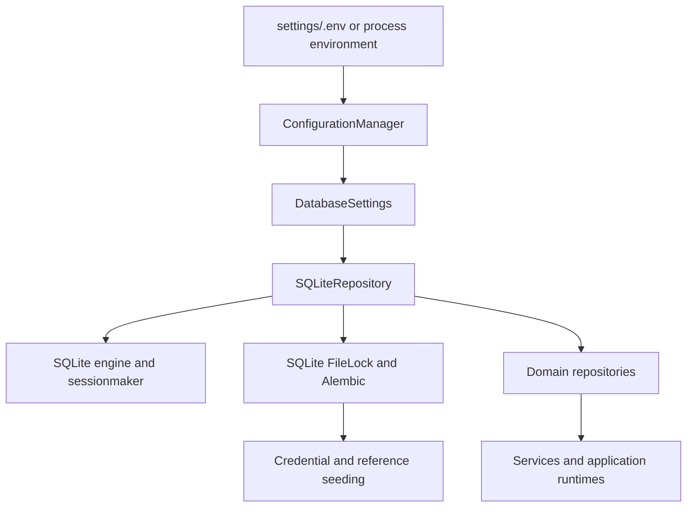

# Persistence

Last updated: 2026-08-20

## SQLite-only relational storage

AEGIS uses one local SQLite database. The application resolves the database
file through `server.common.paths.resolve_database_file_path()`:

- default: `<repo>/app/resources/runtime/database.db`
- optional data-root override: `AEGIS_DATA_DIR`

`app/server/app.py` and `app/scripts/initialize_database.py` construct one
`SQLiteRepository` directly from `DatabaseSettings`. That concrete object owns
the SQLAlchemy engine and session factory and is passed to domain repositories.
There is no backend selector, provider registry, or generic database contract.

## Engine and sessions

`app/server/repositories/database/engine.py` is a concrete SQLite helper. Each
connection enables foreign keys, WAL mode, a five-second busy timeout, and
`synchronous=NORMAL`. `check_same_thread=False` is retained because the
application uses a background worker and `asyncio.to_thread`; repositories
still create a short-lived session per operation and never share a session
between requests or threads.

Repository methods own their transaction boundaries. Successful writes commit;
integrity failures roll back before the operation returns an error. SQLite
serializes writers, so transactions remain short and the busy timeout absorbs
normal transient contention. Row-lock APIs that SQLite cannot implement are
not used.

## Initialization and migrations

`app/server/repositories/database/initializer.py` invokes
`migration_runner.py`, then runs the credential and reference-catalog seeders.
Alembic under `app/server/migrations` is the production schema mechanism;
runtime code never calls `Base.metadata.create_all()`.

- an empty file is upgraded to the single Alembic head and seeded;
- a versioned file receives pending migrations and idempotent seeds;
- an unknown revision fails without changing the file;
- a populated file without `alembic_version` fails without stamping or deleting
  data;
- migration and first-start seeding run under a neighboring file lock;
- an existing file is backed up and restored if migration or seeding fails.

Operators must back up a database before deployment. A failed startup never
silently replaces an existing database file.

The canonical schema contains 15 application tables plus `alembic_version`.
Conversations own their context state, message history, message sequence, and
active-run relationship directly; there are no `chat_sessions` or
`conversation_contexts` tables.

## Stored domains

Core relational storage covers conversations and messages, agent runs and
events, steering messages, model settings, encrypted model credentials, and
seeded geospatial reference data. Sequencing, identity, active-run slots,
credential keys, and encryption-material versions are protected by database
constraints. Payload columns use SQLAlchemy `JSON` directly.

The repository/service boundary remains intentional: repositories translate
SQLite/ORM records into domain snapshots, while services own orchestration and
business behavior. Persistence construction remains explicit at the
application composition root.

## Reference catalog policy

Startup orchestration belongs under `app/server/services/catalog/startup.py`.
It invokes the repository seeder after migrations complete.

- static reference data belongs under `app/resources/catalog/reference`;
- loading and parsing belongs under `app/server/services/catalog/loader.py`;
- relational writes belong under `app/server/repositories/catalog/`.

## Frontend persistence

- storage key: `aegis:webapp-state:v4`
- storage type: `sessionStorage`
- TTL: 6 hours
- implementation: `app/client/src/app/core/app-state.ts`
