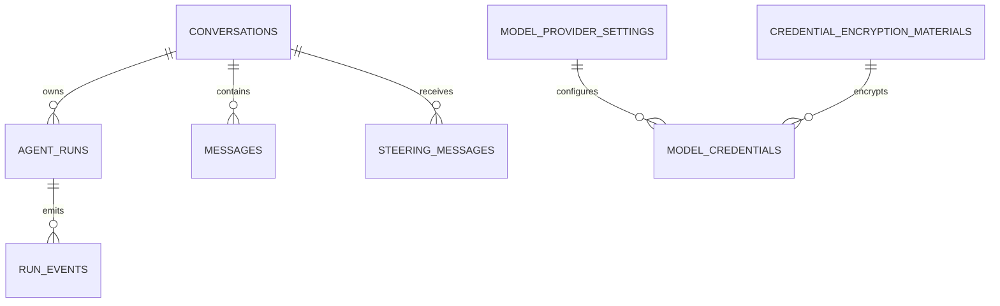

# Persistence

Last updated: 2026-08-20

## Relational Storage

- Runtime selector: `app/server/repositories/database/backend.py` (`build_database_backend`)
- SQLite mode: `EMBEDDED_DATABASE=true`
- PostgreSQL mode: `EMBEDDED_DATABASE=false`
- SQLite implementation: `sqlite.py`
- PostgreSQL implementation: `postgres.py`

Database mode and connection settings come from `settings/.env` or runtime
environment variables. SQLite resolves through
`server.common.paths.DATABASE_FILE_PATH`.

Embedded SQLite storage defaults to the application resources runtime
directory:

- all environments: `<repo>/app/resources/runtime/database.db`

Override this location with `AEGIS_RUNTIME_DATA_DIR` when an explicit runtime
storage directory is required.

The full initialization workflow lives in
`app/server/repositories/database/initializer.py` and
`migration_runner.py`. It is invoked by `app/scripts/initialize_database.py`
for the explicit launcher command and by every application startup. Alembic
under `app/server/migrations` is the authoritative schema mechanism; runtime
code never calls `Base.metadata.create_all()`.

Fresh databases are migrated to the current Alembic head and seeded. Existing
SQLite and PostgreSQL databases are checked on every startup and upgraded when
behind. A populated database without an Alembic version table is adopted only
after comparison proves that it matches the initial baseline. A mismatch fails
without stamping or changing the schema. Repositories receive the already-built
`DatabaseBackend`; they never create tables, infer schema, or resolve a
database singleton themselves.

SQLite migration work is serialized by an adjacent file lock and protected by
a temporary backup that is restored if migration or first-start seeding fails.
PostgreSQL provisioning and migrations use advisory locks.

The shared SQLAlchemy engine configuration is implemented in
`app/server/repositories/database/engine.py`. SQLite connections enable foreign
keys, WAL mode, `busy_timeout`, and `synchronous=NORMAL`; external databases use
pre-ping and bounded pooling. Schema creation is identical across SQLite and
PostgreSQL and is covered by the persistence conformance suite.

The canonical schema contains 15 application tables plus `alembic_version`.
Conversations own their context
state, message history, message sequence, and active-run relationship directly;
there are no `chat_sessions` or `conversation_contexts` tables.

Repositories expose persistence-neutral snapshots and contracts. ORM records do
not cross into services: model settings are mapped to `ModelSettingsSnapshot`,
and run-event appends require both `run_id` and `conversation_id` to match
the owning run.

## Core Stored Domains

Core relational storage covers:

- conversations and messages
- conversations, agent runs, steering messages, and ordered run events
- model provider settings
- encrypted model credentials (backed by auto-seeded Fernet key material)
- seeded geospatial reference data

Message and run-event sequencing is allocated atomically from the owning row,
and request/mutation identity, active-run slots, credential logical keys, and
encryption-material versions are protected by database constraints. Conversation
context revision writes use a conditional update and fail on stale revisions.
Payload columns use portable SQLAlchemy JSON values on both backends.

## Encryption Material

- Credential encryption uses Fernet symmetric keys stored in `credential_encryption_materials` table.
- Keys are auto-generated via `Fernet.generate_key()` during first-time database
  initialization (idempotent).
- Key material is managed by `app/server/repositories/credential_material.py` (`CredentialEncryptionMaterialRepository`).
- Encryption/decryption is handled by `app/server/services/cryptography.py` (`CredentialEncryptionService`).
- No encryption key lives in source code, `.env`, or settings files.

The application creates one database backend per process and injects it into
repositories and startup services. There is no database facade, cached
database accessor, or compatibility import path.

## Reference Catalog Policy

Startup orchestration belongs under
`app/server/services/catalog/startup.py`; it invokes the repository seeder
after migrations complete.

- Static reference data belongs under `app/resources/catalog/reference`.
- Reference catalog file loading and parsing belongs under `app/server/services/catalog/loader.py`.
- Reference catalog seeding (DB write) belongs under `app/server/repositories/catalog/`.
- New catalog/reference constants should not be hardcoded in `app/server/common/constants.py`.
- First-time SQLite initialization and explicit PostgreSQL initialization seed
  empty reference tables from catalog files exactly once per table group.

## Vector Persistence

- Agent tool visibility does not depend on embeddings or vector ranking.

## Model Capability Persistence

- Cloud model capabilities are declared in `app/server/services/llm/cloud_catalog.py`.
- DeepSeek, OpenCode Zen, and OpenCode Go catalogs are fetched on explicit
  provider requests using encrypted credentials; source health is returned to
  Settings and a failed refresh is not represented as a valid empty catalog.
- Ollama tool support is detected from provider capabilities or a cached probe.
- Agent assignment requires tool support.
- Parser assignment requires structured-output support.

## Frontend Persistence

- Storage key: `aegis:webapp-state:v4`
- Storage type: `sessionStorage`
- TTL: 6 hours
- Tab ownership guard: `localStorage` heartbeat keys
- Implementation: `app/client/src/app/core/app-state.ts`
- Chat state persists the conversation ID, context revision, task snapshot, active run IDs, and stream diagnostics. Internal numeric chat-session IDs are not frontend state.
