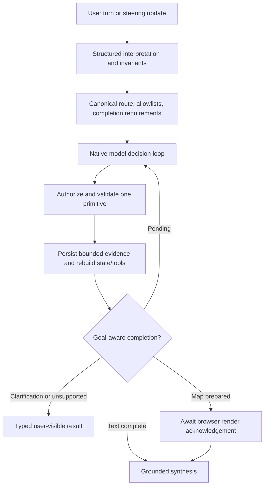

# AEGIS native-agent runtime v4

AEGIS keeps one orchestrating agent.  Planning, scheduling, validation, and
checkpointing are ordinary typed Python services; no LangGraph/LangChain agent
runtime is introduced.

## State boundary

`server.domain.agent.runtime` owns the v3 contracts:

- `AgentThreadState` is durable conversation state (`schema_version=3`) and
  contains the goal, dependency-aware tasks, geospatial working state, evidence
  references, assumptions, unresolved questions, and active map session.
- `AgentRunState` is per-execution state: budgets, counters, canonical call
  fingerprints, plan revision, no-progress detection, and canonical stopping
  reason. Native runs also carry capability domains, dynamic tool exposure
  reasons, completion requirements, iteration traces, and context allocations.
- `GeospatialWorkingState` keeps locations, scope/bounds/radius/CRS, exclusions,
  candidates, selected places, data sources, layers, features, temporal limits,
  and renderable references first-class.

The persisted conversation task snapshot is now v3 only. There is no reader or
fallback for the former turn-ledger snapshot; local development data should be
recreated when the schema changes. Run presentation is separate from committed
conversation state: a valid candidate waits in `awaiting_render` until a
matching browser acknowledgment promotes it.

## Scheduling and safety

Task graphs are validated for unique IDs, missing dependencies, and cycles.
Dependent tasks run only after every required predecessor is `completed`; a
failed predecessor blocks dependents.  Tool calls are fingerprinted from a
canonical JSON representation, so a successful or non-retryable failed call is
not repeated.  Transient retries are bounded and delayed by 250 ms.

Tool-capable models use the native loop immediately after deterministic
interpretation. Explicitly non-tool-capable models may use the ordered
deterministic executor. A native provider failure is surfaced; it never falls
back to another model or silently replays the deterministic plan. The loop
applies 12 iterations, 10 model calls, 20 tool calls, 32 meaningful state
transitions, three no-progress decisions, one retry for an idempotent transient
failure, and the five-minute hard ceiling. Tool argument/domain validation
remains in application code and occurs before a handler is called.

## Context and evidence

The model receives a typed working state, current goal and constraints,
relevant geospatial evidence summaries, unresolved failures, and a token-aware
recent-message projection. Raw payloads remain addressable through
conversation-scoped evidence references and are never re-injected on every
iteration. The canonical request interpretation is compiled once per turn;
the native model owns primitive ordering while the deterministic boundary owns
authorization, validation, persistence, and completion checks. The eight
primitives are location resolution, capability discovery/description/execution,
provider-layer discovery, evidence inspection/transformation, and map
preparation. Map preparation is not visible completion until a matching
MapLibre `map.render_ack` is accepted.

## Observability

`RunEventType.TRACE` and `RunEventType.CHECKPOINT` are internal durable events.
They record the objective, checkpoint state hash, task snapshot, completion
reason, model/tool counts, and operational decisions.  They never contain hidden
chain-of-thought or credentials and are not fanned out to the user stream.

## Provider contract

The OpenAI Responses adapter uses Responses-native top-level function tools and
`function_call` / `function_call_output` input items.  Responses output items
are retained for the next iteration, while Chat Completions-shaped adapters
remain isolated to their own providers.

## Research basis

The design combines observation-driven ReAct execution with selective
Plan-and-Solve decomposition.  It follows the current official guidance on
structured function calling, context engineering, task-specific evaluation,
and trace separation.  Frameworks such as LangGraph were used only as
architectural references for thread/run/checkpoint separation.
