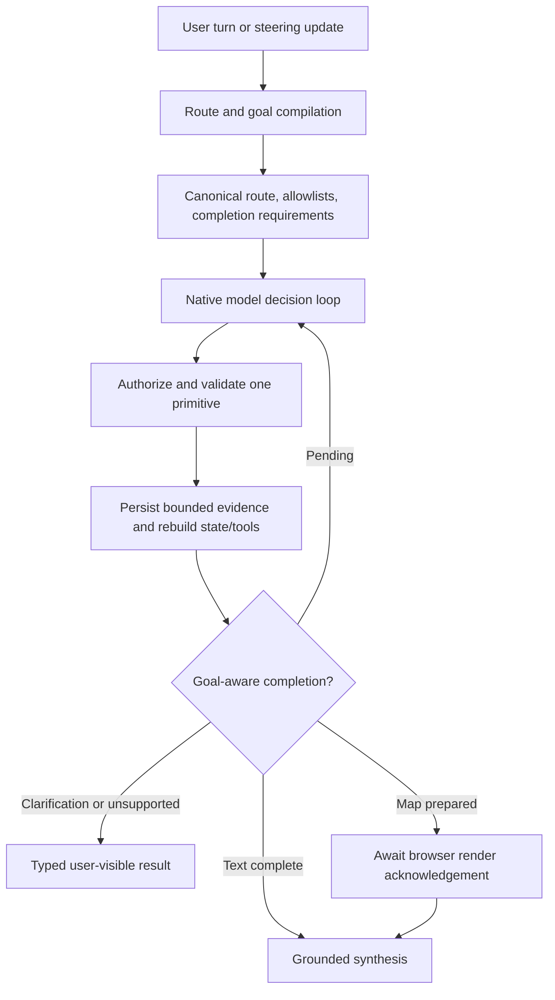

# AEGIS native-agent harness reference

Last updated: 2026-09-15

AEGIS keeps one orchestrating agent.  Planning, scheduling, validation, and
checkpointing are ordinary typed Python services; no LangGraph/LangChain agent
runtime is introduced.

## State boundary

The native contracts are split across the durable conversation model and the
checkpointable run model:

- `ConversationState` is durable conversation state and contains directives,
  summary, goal/route/constraints, resolved locations, evidence references,
  unresolved questions, and the committed map session.
- `AgentRunState` is per-execution state: budgets, counters, canonical call
  fingerprints, route, completion requirements, dynamic tool exposure reasons,
  observations, iteration traces, context allocations, and stopping reason.
- `AgentContextView` is the ephemeral model projection rebuilt before each
  decision; raw provider data remains in conversation-scoped evidence.

The persisted conversation state is stored in one canonical JSON field. Run
presentation is separate from committed conversation state: a valid candidate
waits in `awaiting_render` until a matching browser acknowledgment promotes it.

## Scheduling and safety

Tool calls are fingerprinted from a canonical JSON representation, so a
successful equivalent call is replayed without external execution and repeated
failing calls are suppressed. Transport retries remain bounded at the provider
boundary; semantic recovery returns an observation to the model. The loop
applies bounded iterations, model/tool/transition limits, profile-specific
deadlines, and a five-minute hard ceiling. Tool argument/domain validation
remains in application code and occurs before a handler is called.

## Context and evidence

The model receives a typed working state, current goal and constraints,
relevant geospatial evidence summaries, unresolved failures, and a token-aware
recent-message projection. Raw payloads remain addressable through
conversation-scoped evidence references and are never re-injected on every
iteration. The native route compiler derives deterministic completion
obligations; the model owns semantic action ordering while the application
boundary owns authorization, validation, persistence, and completion checks.
The native action surface is location resolution, capability discovery and
description, capability execution, provider-layer discovery, evidence
inspection/transformation, and map preparation. Map preparation is not visible
completion until a matching MapLibre `map.render_ack` is accepted.

## Observability

`RunEventType.TRACE` and `RunEventType.CHECKPOINT` are internal durable events.
They record the objective, checkpoint state hash, native run-state checkpoint,
conversation projection, completion reason, model/tool counts, and operational
decisions. Native checkpoints are bounded and reloadable for active-run
restart. They never contain hidden chain-of-thought or credentials and are not
fanned out to the user stream.

## Provider contract

The OpenAI Responses adapter uses Responses-native top-level function tools and
`function_call` / `function_call_output` input items.  Responses output items
are retained for the next iteration, while Chat Completions-shaped adapters
remain isolated to their own providers.

## Research basis

The design combines observation-driven ReAct execution with selective
Plan-and-Solve decomposition.  It follows the current official guidance on
structured function calling, context engineering, task-specific evaluation,
and trace separation.  Frameworks such as LangGraph were used only as
architectural references for thread/run/checkpoint separation.
