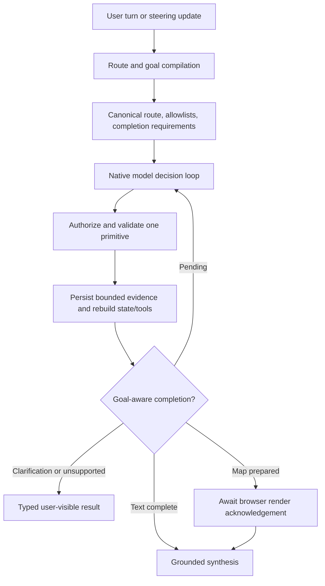

# AEGIS native-agent harness reference

Last updated: 2026-09-30

AEGIS keeps one orchestrating agent.  Planning, scheduling, validation, and
checkpointing are ordinary typed Python services; no LangGraph/LangChain agent
runtime is introduced.

```mermaid
flowchart TD
  U["User turn or steering update"] --> C["Route and goal compilation"]
  C --> R["Canonical route, allowlists, completion requirements"]
  R --> N["Native model decision loop"]
  N --> V["Authorize and validate one primitive"]
  V --> E["Persist bounded evidence and rebuild state/tools"]
  E --> Q{"Goal-aware completion?"}
  Q -->|Pending| N
  Q -->|Clarification or unsupported| H["Typed user-visible result"]
  Q -->|Map prepared| A["Await browser render acknowledgement"]
  Q -->|Text complete| Y["Grounded synthesis"]
  A --> Y
```

## State boundary

The native contracts are split across the durable conversation model and the
checkpointable run model:

- `ConversationState` is durable conversation state and contains directives,
  summary, goal/route/constraints, resolved locations, evidence references,
  unresolved questions, and the committed map session.
- `AgentRunState` is per-execution state: budgets, counters, canonical call
  fingerprints, route, completion requirements, dynamic tool exposure reasons,
  observations, iteration traces, context allocations, and stopping reason.
- `AgentContextView` is the ephemeral model projection rebuilt before each
  decision; raw provider data remains in conversation-scoped evidence.

The persisted conversation state is stored in one canonical JSON field. Run
presentation is separate from committed conversation state: a valid candidate
waits in `awaiting_render` until a matching browser acknowledgment promotes it.

## Scheduling and safety

Tool calls are fingerprinted from a canonical JSON representation, so a
successful equivalent call is replayed without external execution and repeated
failing calls are suppressed. Transport retries remain bounded at the provider
boundary; semantic recovery returns an observation to the model. The loop
applies bounded iterations, model/tool/transition limits, profile-specific
deadlines, and a five-minute hard ceiling. Tool argument/domain validation
remains in application code and occurs before a handler is called.

## Context and evidence

The model receives a typed working state, current goal and constraints,
relevant geospatial evidence summaries, unresolved failures, and a token-aware
recent-message projection. Raw payloads remain addressable through
conversation-scoped evidence references and are never re-injected on every
iteration. The native route compiler derives deterministic completion
obligations; the model owns semantic action ordering while the application
boundary owns authorization, validation, persistence, and completion checks.
The native action surface is location resolution, capability discovery and
description, capability execution, provider-layer discovery, evidence
inspection/transformation, and map preparation. Map preparation is not visible
completion until a matching MapLibre `map.render_ack` is accepted.

## Observability

`RunEventType.TRACE` and `RunEventType.CHECKPOINT` are internal durable events.
They record the objective, checkpoint state hash, native run-state checkpoint,
conversation projection, completion reason, model/tool counts, and operational
decisions. Native checkpoints are bounded and reloadable for active-run
restart. Operational traces redact reasoning and credentials. Private provider
continuation retains opaque SDK parts required for protocol correctness;
REST, polling, streaming, realtime, and trace projections omit that continuation.
Internal checkpoints are not fanned out to the user stream.

## Provider contract

The OpenAI Responses adapter uses Responses-native top-level function tools and
`function_call` / `function_call_output` input items.  Responses output items
are retained for the next iteration, while Chat Completions-shaped adapters
remain isolated to their own providers.

The Google GenAI adapter retains the selected model `Content` as opaque native
continuation metadata: ordered `Part` values, thought signatures, function-call
IDs, and matching function-response IDs, including parallel calls.  The
continuation is serialized in the native provider field and survives JSON
checkpoint round-trips before being reconstructed as provider-native `Content`;
it is not flattened into the common semantic message model or exposed as
ordinary reasoning text.

## Slice 7 — MCP architecture assessment (2026-09-30)

Slice 7 is an evaluation boundary, not a production migration.  Current
evidence retains **C — native dynamic tools** as the production architecture,
with **E — optional hybrid** reserved for a concrete independently hosted,
read-only capability that provides measurable interoperability or isolation
value.

| Architecture | Assessment against the current AEGIS baseline |
| --- | --- |
| **A — Direct tools** | No implementation or comparative run exists.  It would expose a broader capability schema surface than the bounded native meta-tool registry; its token, correctness, recovery, latency, and complexity effects are unmeasured. |
| **B — Thematic MCP** | No MCP integration or requirement is present.  A blanket weather/traffic/satellite migration would add a separate protocol and deployment boundary without demonstrated benefit. |
| **C — Native dynamic tools** | Current production path: route validation precedes bounded tool exposure, one executor owns validation and normalization, and evidence, completion, checkpoint, cancellation, and render acknowledgment remain application-owned. |
| **D — Hierarchical routing** | Already partly represented inside C: the internal `route_request` phase and `CapabilityRouter` constrain domains and operations before shortlist and execution.  A second routing hierarchy has no demonstrated benefit. |
| **E — Hybrid** | No MCP side is implemented.  Keep this as an optional future boundary only when an independent capability has a verified external-client or isolation requirement. |

The official [MCP specification](https://modelcontextprotocol.io/specification)
currently resolves to revision `2026-07-28`, which defines JSON-RPC 2.0,
stateless self-contained requests, and per-request capability negotiation.  The
official [Python SDK v2.0.0 release](https://github.com/modelcontextprotocol/python-sdk/releases/tag/v2.0.0)
supports that revision and earlier protocol eras.  The release warning in the
architecture plan is therefore current and carries migration cost.

Comparative metrics remain unmeasured: model-visible schema token count,
selection/completion/recovery correctness across A–E, request latency,
connection and discovery overhead, implementation complexity, debuggability,
error propagation, security and credential boundaries, deployment requirements,
state and checkpoint behavior, provider extensibility, schema safety, and reuse
by external MCP clients.  Native trace, budget, and checkpoint instrumentation
does not constitute a cross-architecture benchmark.

No MCP pilot is justified at this boundary because no external MCP client or
independent isolation requirement is documented.  Retain C, keep map rendering,
persistence, and the agent loop native, and revisit E only when that requirement
appears with shared fixtures and a measurable comparison target.

## Research basis

The design combines observation-driven ReAct execution with selective
Plan-and-Solve decomposition.  It follows the current official guidance on
structured function calling, context engineering, task-specific evaluation,
and trace separation.  Frameworks such as LangGraph were used only as
architectural references for thread/run/checkpoint separation.
